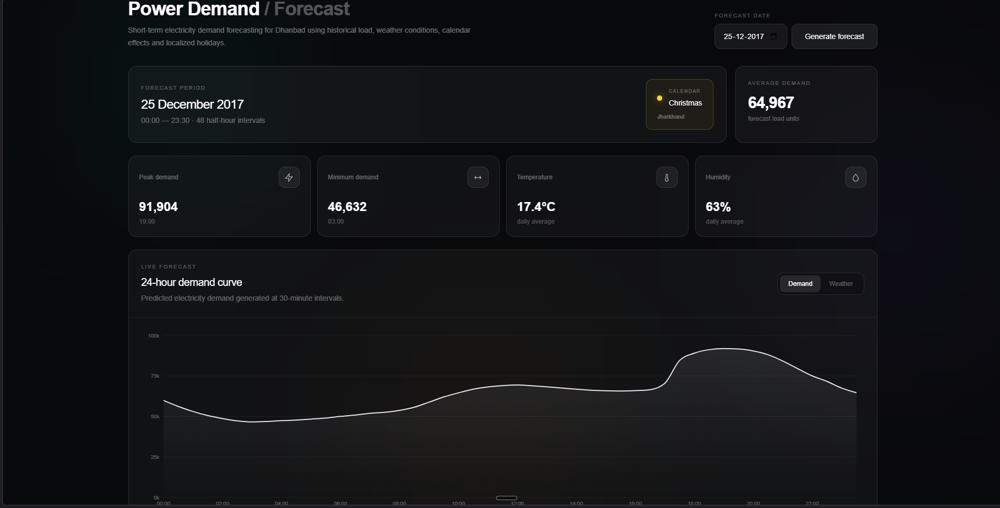
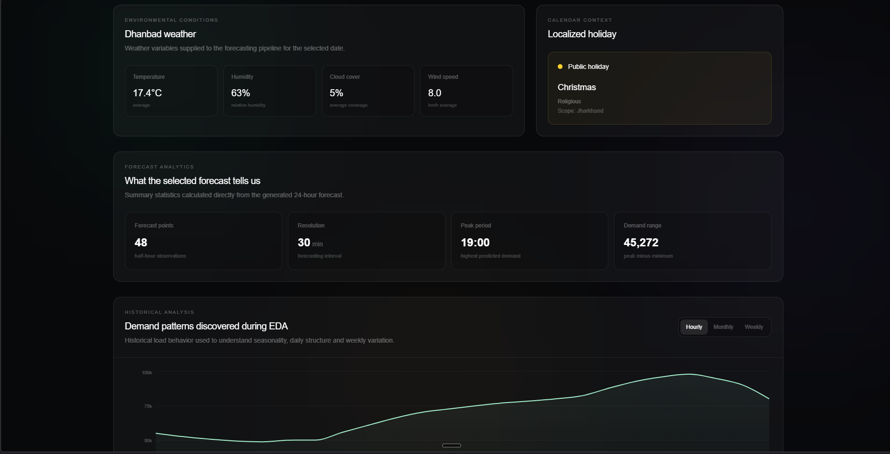
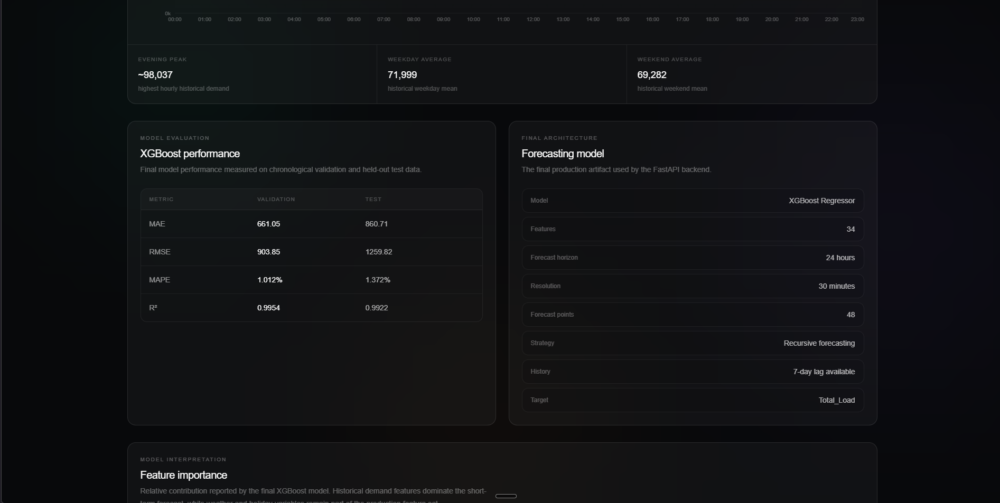
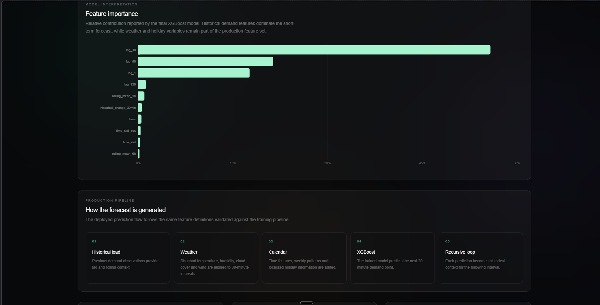

# Intelligent Power Demand Forecasting System
An end-to-end electricity demand forecasting system for Dhanbad, Jharkhand. The system processes historical electricity consumption data, integrates Dhanbad-specific weather and localized holiday information, performs feature engineering, trains and evaluates forecasting models, and provides a production-ready 24-hour forecast through a FastAPI backend and Next.js dashboard.


The complete application is containerized using Docker and Docker Compose.

---

## Working Project — Dashboard Screenshots

The following screenshots were captured from the working application and demonstrate the interactive dashboard, 24-hour demand forecasting, weather and localized holiday context, model evaluation, feature importance, and production forecasting pipeline.

### 1. Dashboard Overview



*Main dashboard showing the selected forecast date, holiday context, demand statistics, and 24-hour forecast curve.*

### 2. Weather and Localized Holiday Context



*Dhanbad weather conditions and localized holiday information associated with the selected forecast period.*

### 3. Model Performance and Forecasting Architecture



*Final XGBoost validation/test performance and the production forecasting model configuration.*

### 4. Feature Importance and Production Pipeline



*Feature importance from the final XGBoost model and the end-to-end production forecasting pipeline.*


---


## 1. Project Objective
The objective of this project is to develop a robust short-term electricity demand forecasting system.


The historical electricity consumption data is available at 10-minute intervals. The forecasting system produces electricity demand forecasts at 30-minute intervals for the next 24 hours.


### Forecast configuration
- Location: Dhanbad, Jharkhand

- Original data resolution: 10 minutes

- Forecast resolution: 30 minutes

- Forecast horizon: 24 hours

- Forecast points: 48

- Forecast target: Total electricity demand


_>&#x20;_**Note:**_&#x20;The assignment document states that the forecast should use 30-minute blocks, which results in 48 blocks for 24 hours. One section of the assignment mentions 96 blocks for 24 hours. This implementation follows the stated 30-minute resolution and therefore produces 48 forecast points._


---


## 2. Key Features
- Exploratory Data Analysis (EDA)

- Electricity demand data cleaning

- Missing-value and duplicate analysis

- Outlier investigation

- Cross-feeder demand analysis

- Hourly demand analysis

- Day-of-week analysis

- Weekday/weekend analysis

- Monthly and seasonal analysis

- Dhanbad-specific weather integration

- Localized Jharkhand/Dhanbad holiday integration

- Calendar and cyclical time features

- Historical demand lag features

- Rolling statistical features

- Chronological train/validation/test splitting

- Baseline forecasting models

- Multiple machine learning model comparisons

- XGBoost hyperparameter tuning

- Final XGBoost model

- Recursive 24-hour forecasting

- Production feature parity validation

- FastAPI backend

- Next.js interactive dashboard

- Demand forecast visualization

- Weather visualization

- Holiday information

- Docker containerization

- Docker Compose orchestration


---


## 3. System Architecture
```text

                    Historical Electricity Data

                              │

                              ▼

                    Data Cleaning & EDA

                              │

                              ▼

             ┌────────────────┼────────────────┐

             │                │                │

             ▼                ▼                ▼

       Historical Load      Weather         Holidays

             │                │                │

             │        Dhanbad Weather         │

             │                │                │

             └────────────────┼────────────────┘

                              │

                              ▼

                    Feature Engineering

                              │

                              ▼

                    Model Training & Tuning

                              │

                              ▼

                     Final XGBoost Model

                              │

                              ▼

                       FastAPI Backend

                              │

                              ▼

                  Recursive 24-Hour Forecast

                              │

                              ▼

                    Next.js Dashboard

                              │

                              ▼

                         Docker

```


---


## 4. Dataset
The primary electricity consumption dataset provided for the project is:


```text

data/raw/Utility_consumption.csv

```


The dataset contains electricity consumption measurements from three 132 kV feeders:


- \`F1_132KV_PowerConsumption\`

- \`F2_132KV_PowerConsumption\`

- \`F3_132KV_PowerConsumption\`


The total electricity demand is calculated as:


```text

Total_Load = F1 + F2 + F3

```


### Dataset characteristics
- Original resolution: 10 minutes

- Coverage: 2017-01-01 to 2017-12-30

- Number of original rows: 52,416

- Number of feeders: 3

- Forecast target: \`Total_Load\`


The historical dataset does not contain observations for 2017-12-31. The production demonstration forecast therefore uses historical demand available before the forecast period together with the prepared forecast-day weather data.


---


## 5. Exploratory Data Analysis
The complete EDA and modelling workflow is documented in:


```text

notebooks/01_power_demand_forecasting.ipynb

```


The notebook covers:


1\. Dataset inspection

2\. Datetime parsing

3\. Timestamp ordering and frequency checks

4\. Missing-value analysis

5\. Duplicate analysis

6\. Load distributions

7\. Boxplot and IQR-based outlier screening

8\. Temporal outlier investigation

9\. Cross-feeder analysis

10\. Hourly demand profile

11\. Day-of-week demand profile

12\. Weekday vs weekend analysis

13\. Hour × day heatmap

14\. Daily demand trends

15\. Monthly and seasonal analysis

16\. Preliminary weather relationships

17\. Integrated weather and holiday analysis

18\. Feature engineering

19\. Model training

20\. Model comparison

21\. Hyperparameter tuning

22\. Final test evaluation

23\. Residual analysis

24\. Feature importance analysis


---


## 6. Data Cleaning and Outlier Handling
The dataset was checked for:


- Invalid timestamps

- Missing timestamps

- Duplicate timestamps

- Missing values

- Demand distribution anomalies

- Feeder-level outliers


IQR analysis identified a number of high-demand observations, particularly in feeder F3.


These observations were not automatically removed. The potentially anomalous observations were investigated using temporal and cross-feeder analysis.


The analysis showed that many high F3 values occurred together with elevated demand in the other feeders. Therefore, these observations could represent genuine system-wide demand peaks rather than isolated measurement errors.


The final approach was:


- Use IQR as an anomaly screening method.

- Investigate suspicious observations.

- Compare feeder behaviour.

- Retain synchronized demand peaks when they appear to represent genuine system behaviour.


This avoids artificially removing legitimate high-demand periods from the training data.


---


## 7. Weather Integration
The assignment requires weather information specific to Dhanbad, Jharkhand.


Dhanbad weather data was obtained using the Open-Meteo Historical Weather API.


The following weather variables were integrated:


- Temperature

- Relative humidity

- Cloud cover

- Wind speed


The resulting columns are:


```text

Dhanbad_Temperature

Dhanbad_Humidity

Dhanbad_CloudCover

Dhanbad_WindSpeed

```


Historical weather observations were converted to 30-minute resolution through time interpolation.


The integrated historical dataset is:


```text

data/processed/integrated_demand_weather_holidays.csv

```


The prepared production forecast weather file is:


```text

data/production/dhanbad_forecast_weather_2017-12-31.csv

```


---


## 8. Holiday Integration
Localized holiday information was integrated because electricity demand patterns can differ on public holidays and region-specific holidays.


The holiday information includes:


- Holiday name

- Holiday type

- Scope

- Public holiday indicator


The integrated columns are:


```text

Holiday_Name

Holiday_Type

Scope

Is_Public_Holiday

```


The project uses localized Jharkhand-related holiday information rather than relying only on a generic national calendar.


---


## 9. Feature Engineering
The final production model uses 34 features.


### Calendar and time features
```text

hour

minute

day_of_week

day_of_month

month

day_of_year

week_of_year

is_weekend

time_slot

```


### Cyclical features
```text

time_slot_sin

time_slot_cos

day_of_week_sin

day_of_week_cos

day_of_year_sin

day_of_year_cos

```


### Holiday feature
```text

is_holiday

```


### Weather features
```text

Dhanbad_Temperature

Dhanbad_Humidity

Dhanbad_CloudCover

Dhanbad_WindSpeed

```


### Weather interaction
```text

Temperature_Humidity

```


### Historical demand features
```text

lag_1

lag_2

lag_4

lag_48

lag_96

lag_336

```


These correspond to:


```text

lag_1   = 30 minutes

lag_2   = 1 hour

lag_4   = 2 hours

lag_48  = 24 hours

lag_96  = 48 hours

lag_336 = 7 days

```


### Rolling features
```text

rolling_mean_1h

rolling_mean_2h

rolling_mean_6h

rolling_mean_24h

rolling_std_2h

rolling_std_24h

```


### Historical change
```text

historical_change_30min

```


The final production feature set uses only information available before the prediction timestamp in order to prevent target leakage.


---


## 10. Data Splitting
A chronological split was used because this is a time-series forecasting problem.


The model-ready data was divided into:


```text

Training:   70%

Validation: 15%

Testing:    15%

```


### Training
```text

2017-01-08 to 2017-09-13

```


### Validation
```text

2017-09-14 to 2017-11-05

```


### Test
```text

2017-11-06 to 2017-12-30

```


No future observations were randomly mixed into the training data.


---


## 11. Baseline Models
The following simple forecasting baselines were evaluated:


- Previous 30-minute demand

- Previous-day demand

- Previous-week demand


These baselines provide reference performance for evaluating the machine learning models.


---


## 12. Model Comparison
Multiple forecasting approaches were evaluated:


- Random Forest

- HistGradientBoosting

- Extra Trees

- LightGBM

- CatBoost

- LSTM

- XGBoost


The experiments showed that tree-based gradient boosting approaches were effective for the engineered tabular time-series features.


XGBoost was selected for the final production model based on its validation performance and suitability for the feature structure.


---


## 13. Final XGBoost Model
The final model uses the following configuration:


```text

n_estimators       = 620

learning_rate      = 0.026937

max_depth          = 7

min_child_weight   = 3

subsample          = 0.711324

colsample_bytree   = 0.781407

gamma              = 0.285447

reg_alpha          = 0.664386

reg_lambda         = 1.620612

```


The trained model is stored at:


```text

models/final_xgboost_model.pkl

```


The feature metadata is stored at:


```text

models/feature_metadata.pkl

```


---


## 14. Model Performance
### Validation Performance
\| Metric | XGBoost |

\|---|---:|

\| MAE | 661.05 |

\| RMSE | 903.85 |

\| MAPE | 1.012% |

\| R² | 0.99537 |


### Final Test Performance
\| Metric | XGBoost |

\|---|---:|

\| MAE | 860.71 |

\| RMSE | 1259.82 |

\| MAPE | 1.372% |

\| R² | 0.99217 |


The test set was evaluated after model selection and was not used for hyperparameter tuning.


The later test period shows some distribution shift compared with the validation period, but the final model maintains strong forecasting performance.


---


## 15. Feature Importance
The most influential features in the final XGBoost model were primarily historical demand features.


The leading features include:


```text

lag_48

lag_96

lag_1

lag_336

rolling_mean_1h

historical_change_30min

hour

time_slot_cos

time_slot

rolling_mean_6h

```


The strong contribution of lag features is expected for short-term electricity demand forecasting because recent and periodic historical demand contains significant information about future demand.


Weather and holiday features are retained as required external contextual features.


---


## 16. Recursive 24-Hour Forecasting
The production API generates the 24-hour forecast recursively.


The process is:


```text

Historical actual demand

        ↓

Predict first 30-minute interval

        ↓

Append prediction to history

        ↓

Generate next feature vector

        ↓

Predict next interval

        ↓

Repeat

        ↓

48 predictions

```


The model therefore generates a complete 24-hour forecast while using predicted values for future lag features where actual future demand is unavailable.


---


## 17. Production Feature Validation
Production feature generation was tested against the saved training, validation, and test feature datasets.


Six timestamps were used for feature parity testing.


All tested timestamps passed.


The maximum observed numerical difference was:


```text

2.867819e-08

```


The validation tolerance was:


```text

1e-6

```


Therefore, the production feature-generation logic matches the training feature-generation logic within floating-point tolerance.


The production validation notebook is:


```text

notebooks/02_production_feature_testing.ipynb

```


---


## 18. Backend API
The backend is implemented using FastAPI.


### Health Check
```http

GET /health

```


Example response:


```json

{

  "status": "healthy",

  "model_features": 34,

  "historical_records": 17472

}

```


### 24-Hour Forecast
```http

GET /forecast?datetime=2017-12-31%2000:00:00

```


The forecast endpoint returns:


- Forecast date

- Forecast start

- Forecast end

- Forecast interval

- Number of forecast points

- Holiday information

- Predicted electricity demand

- Temperature

- Humidity

- Cloud cover

- Wind speed


For a 24-hour forecast at 30-minute resolution, the API returns 48 points.


### Additional Endpoints
```text

/predict

/analytics

/prediction-context

```


Interactive API documentation is available through:


```text

http\://localhost:8000/docs

```


---


## 19. Frontend Dashboard
The frontend is built using:


- Next.js

- React

- TypeScript

- Recharts

- Tailwind CSS


The dashboard provides:


- Date-based forecast generation

- 24-hour demand forecast chart

- Weather visualization

- Temperature information

- Humidity information

- Cloud cover information

- Holiday information

- Peak demand

- Minimum demand

- Average demand

- Historical demand analysis

- Model performance

- Feature importance

- Forecast methodology


---


## 20. Project Structure
```text

Project-1/

│

├── backend/

│   ├── \_\_init\_\_.py

│   ├── main.py

│   ├── feature_engineering.py

│   ├── forecast_service.py

│   ├── model_service.py

│   ├── schemas.py

│   ├── requirements.txt

│   ├── Dockerfile

│   └── .dockerignore

│

├── frontend/

│   ├── app/

│   ├── public/

│   ├── package.json

│   ├── package-lock.json

│   ├── Dockerfile

│   └── .dockerignore

│

├── data/

│   ├── raw/

│   │   └── Utility_consumption.csv

│   ├── processed/

│   │   ├── integrated_demand_weather_holidays.csv

│   │   ├── train_features.csv

│   │   ├── validation_features.csv

│   │   └── test_features.csv

│   └── production/

│       └── dhanbad_forecast_weather_2017-12-31.csv

│

├── models/

│   ├── final_xgboost_model.pkl

│   └── feature_metadata.pkl

│

├── notebooks/

│   ├── 01_power_demand_forecasting.ipynb

│   └── 02_production_feature_testing.ipynb

│

├── docker-compose.yml

├── requirements.txt

├── README.md

└── .gitignore

```


---


## 21. Running the Project with Docker
Docker is the recommended method for running the complete application.


### Requirements
Install:


- Docker Desktop

- Git


Python and Node.js are not required separately when using the Docker setup.


### Clone the repository
```bash

git clone \<YOUR_GITHUB_REPOSITORY_URL>

cd Project-1

```


### Start the application
```bash

docker compose up --build

```


The first build may take several minutes because the backend installs the machine learning dependencies.


### Run in detached mode
```bash

docker compose up -d --build

```


### Check containers
```bash

docker compose ps

```


### Access the frontend
```text

http\://localhost:3000

```


### Access the backend
```text

http\://localhost:8000

```


### Access FastAPI documentation
```text

http\://localhost:8000/docs

```


### Stop the application
```bash

docker compose down

```


---


## 22. Backend Verification
After starting Docker, verify the backend:


```bash

curl http\://localhost:8000/health

```


Test the 24-hour forecast:


```bash

curl "http\://localhost:8000/forecast?datetime=2017-12-31%2000:00:00"

```


The forecast should contain:


```text

48 forecast points

30-minute interval

00:00 through 23:30

```


---


## 23. Running the Notebooks
The main notebook is:


```text

notebooks/01_power_demand_forecasting.ipynb

```


It documents:


```text

Data

  ↓

EDA

  ↓

Data Cleaning

  ↓

Weather & Holiday Integration

  ↓

Feature Engineering

  ↓

Chronological Split

  ↓

Baseline Models

  ↓

Model Comparison

  ↓

XGBoost Tuning

  ↓

Final Evaluation

  ↓

Feature Importance

```


The production testing notebook is:


```text

notebooks/02_production_feature_testing.ipynb

```


It validates the production feature-generation pipeline and confirms feature parity with the saved modelling datasets.


---


## 24. Reproducibility
The provided mock dataset is included in the repository:


```text

data/raw/Utility_consumption.csv

```


Processed datasets are also included.


The trained model artifact is included:


```text

models/final_xgboost_model.pkl

```


The feature metadata is included:


```text

models/feature_metadata.pkl

```


The production forecast weather data is included:


```text

data/production/dhanbad_forecast_weather_2017-12-31.csv

```


The saved model allows the backend to run without retraining the model.


---


## 25. Data Handling Decisions
### Outliers
Potential outliers were investigated rather than automatically removed because synchronized feeder peaks may represent genuine demand events.


### Missing values
The data was checked for missing timestamps and values. Weather observations were converted to 30-minute resolution through interpolation.


### Time-series splitting
Random splitting was avoided to prevent temporal leakage.


### Target leakage
Features that used the current target value were excluded from the final production feature set.


Only historical information available before the prediction timestamp is used.


### Recursive forecasting
During the 24-hour forecast, previously predicted demand values are appended to the recursive history and used to generate future lag and rolling features.


---


## 26. Limitations
1\. The historical electricity dataset covers approximately one year.

2\. The test period contains a limited number of localized holiday observations.

3\. The production demonstration uses a prepared forecast-weather dataset for the included forecast date.

4\. Forecast accuracy can vary when future demand patterns differ substantially from historical patterns.

5\. The model is designed for short-term forecasting rather than long-term electricity demand forecasting.

6\. The current production demonstration uses the prepared forecast weather artifact rather than performing a live weather API request for every forecast request.

7\. The assignment contains an inconsistency between the stated 30-minute resolution and the mention of 96 blocks. This implementation follows the 30-minute resolution and produces 48 forecast points for 24 hours.


---


## 27. Technology Stack
### Data Science
- Python

- Pandas

- NumPy

- Scikit-learn

- XGBoost

- Matplotlib

- Jupyter Notebook


### Backend
- FastAPI

- Uvicorn

- Pydantic

- Joblib

- XGBoost


### Frontend
- Next.js

- React

- TypeScript

- Recharts

- Tailwind CSS


### Deployment
- Docker

- Docker Compose


### Weather Data
- Open-Meteo Historical Weather API


---


## 28. Final End-to-End Workflow
```text

                  Utility Consumption Data

                           │

                           ▼

                    Data Cleaning

                           │

                           ▼

                          EDA

                           │

                           ▼

              Weather & Holiday Integration

                           │

                           ▼

                  Feature Engineering

                           │

                           ▼

                Chronological Data Split

                           │

                           ▼

                  Model Comparison

                           │

                           ▼

                    XGBoost Tuning

                           │

                           ▼

                  Final XGBoost Model

                           │

                           ▼

                   Saved Model Artifact

                           │

                           ▼

                    FastAPI Backend

                           │

                           ▼

                Recursive 24h Forecast

                           │

                           ▼

                  Next.js Dashboard

                           │

                           ▼

                         Docker

```


---


## 29. Submission Contents
This repository contains the components required for the assignment submission:


- Jupyter notebook documenting EDA

- Data cleaning workflow

- Feature engineering

- Model comparison and justification

- Model validation

- Production feature validation

- Backend API

- Frontend visualization dashboard

- Docker configuration

- Comprehensive README

- Provided \`Utility_consumption.csv\` mock data

- Processed datasets

- Saved model artifact

- Feature metadata

- Production forecast weather data


---


## 30. Author
Developed as an Intelligent Power Demand Forecasting project for the internship assignment.


### Project Configuration
```text

Location: Dhanbad, Jharkhand

Forecast Horizon: 24 hours

Forecast Interval: 30 minutes

Forecast Points: 48

Final Model: XGBoost

Backend: FastAPI

Frontend: Next.js

Deployment: Docker Compose

```